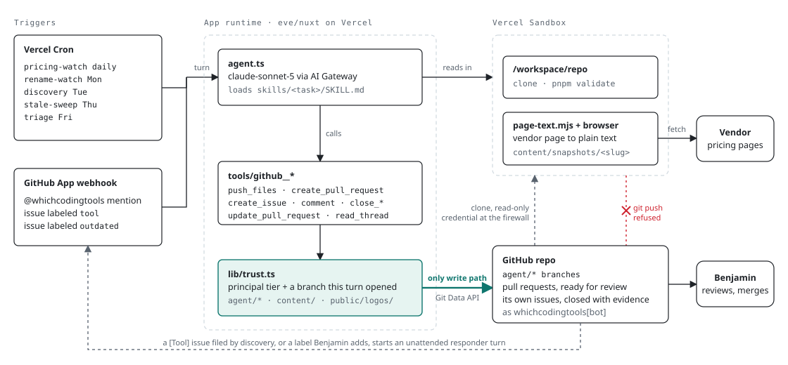

# The maintenance agent

An [eve](https://eve.dev) agent that keeps `content/tools` fresh. It deploys with the site through the `eve/nuxt` module: the schedules become Vercel Cron jobs, the repo checkout runs in a Vercel Sandbox, the model goes through AI Gateway with the project's OIDC token.

<picture>
  <source media="(prefers-color-scheme: dark)" srcset="docs/schema-dark.svg">
  
</picture>

The sandbox reads, the runtime writes. A turn starts from a cron or a GitHub event, reads inside a sandbox that can only clone, and the one way anything reaches the repository is `github__push_files` in the app runtime, which opens pull requests a person merges. The rest of this file is the detail behind that picture.

## Rules that do not bend

- It never edits `content/tools` on `main`. Every change is a pull request a person merges.
- The only writes it can reach are commits on `agent/*` branches under `content/` and `public/logos/`, pull requests, issues, and closing its own issues once the finding is resolved.
- Every number it writes comes from a vendor page it fetched in that run, never from memory.
- It says who it is, `whichcodingtools-agent/1.0 (+https://whichcoding.tools/crawler)`, and it reads an origin's robots.txt before any page there. A page reserved from it is reported, never fetched.

## How those rules are enforced

Not by the instructions. The instructions restate them, they do not implement them.

The sandbox is brokered a GitHub credential at the firewall for the two git endpoints that read a repository, `info/refs?service=git-upload-pack` and `git-upload-pack`. Nothing matches `git-receive-pack`, so a `git push` from the sandbox goes out unauthenticated and GitHub refuses it. Work leaves through `github__push_files`, which runs in the app runtime where the token actually lives, reads the named files out of the checkout, and commits them through the Git Data API. That tool is where the `^agent/[a-z0-9-]+$` branch shape and the path allow-list are checked, anything under `content/` plus a lowercase `.png` in `public/logos/`, and it moves refs fast-forward only.

The credential-free policy sits on the sandbox backend factory, not only in `onSession`, because a provider-loss replacement reuses the session key and never reruns `onSession`. A replacement comes up able to read vendor pages and unable to touch the repository. `hooks/sandbox-refresh.ts` reapplies the brokered read-only policy on every turn, which covers both the one-hour lifetime of an installation token and the replacement case.

The GitHub channel replaces eve's default `turn.started` handler for the same reason: the default checks the repository out a second time at `/workspace` and rebrokers an unrestricted github.com credential, which would hand every channel turn the push everything else is arranged to withhold.

## Layout

Files under `agent/` are wiring, logic lives in `agent/lib/`, procedures are skills the model loads on demand.

```
agent/
  agent.ts                          model (anthropic/claude-sonnet-5 via AI Gateway), reasoning, token caps
  instructions.md                   identity and the rules above
  channels/eve.ts                   HTTP surface, Vercel OIDC or localhost auth
  channels/github.ts                GitHub App via Vercel Connect: @whichcodingtools mentions, the two issue-form responders, and the agent's own `tool` candidates
  extensions/browser.ts             a real browser for pricing pages that render client side
  hooks/sandbox-refresh.ts          per-turn network policy refresh, re-clone when the workspace is gone
  schedules/pricing-watch.ts        daily 06:15 UTC, task mode (no chat channel needed)
  schedules/discovery.ts            Tuesdays 12:00 UTC, the one pass that looks outside the corpus
  schedules/rename-watch.ts         Mondays 12:00 UTC
  schedules/acp-watch.ts            Wednesdays 12:00 UTC, the ACP Agent Registry read against the corpus
  schedules/stale-sweep.ts          Thursdays 12:00 UTC
  schedules/triage.ts               Fridays 09:00 UTC, a pass over everything still open
  schedules/consistency-sweep.ts    monthly, the 1st 13:00 UTC, the corpus read side by side
  skills/pricing-watch/SKILL.md     the sweep procedure
  skills/discovery/SKILL.md         tools the directory does not carry yet, one candidate a week
  skills/rename-watch/SKILL.md      homepage redirects, new names, description drift
  skills/acp-watch/SKILL.md         acp-agent flags, and the wraps of the registry's two clients
  skills/stale-sweep/SKILL.md       tools past 60 days without a re-check
  skills/contributing/SKILL.md      the data and PR rules, mirrors CONTRIBUTING.md
  skills/outdated-report/SKILL.md   one reported field, re-read against its vendor page
  skills/triage/SKILL.md            a pass over every open issue and PR, checked against main
  skills/consistency-sweep/SKILL.md the same fact encoded two ways in two files
  tools/github__find_related.ts     search issues and PRs, open and closed (dedupe)
  tools/github__list_open.ts        everything currently open, for a stocktake rather than a lookup
  tools/github__read_thread.ts      the discussion on one issue or PR, fenced as data
  tools/github__comment.ts          say something in a thread without closing it
  tools/github__push_files.ts       the only write path out of the sandbox
  tools/github__create_pull_request.ts    opens ready for review, never merges
  tools/github__update_pull_request.ts    keeps its title and body in step with the branch
  tools/github__create_issue.ts
  tools/github__close_issue.ts      close the agent's own issues once resolved, with evidence
  tools/github__close_pull_request.ts  close one of its own whose finding no longer holds
  tools/ask_question.ts             disables eve's built-in question tool, which the GitHub channel would post as a comment
  subagents/reviewer/               a diff read the way the site renders it, on Opus, before any pull request opens or grows
  lib/github.ts                     REST helpers, the Git Data API push, Connect installation token (whichcodingtools[bot])
  lib/network-policy.ts             the read-only git firewall policy, shared by the sandbox and the hook
  lib/checkout.ts                   clone and refresh /workspace/repo, with exit codes actually checked
  lib/trust.ts                      who is the maintainer, which turns are unattended, who may push
  lib/thread.ts                     the thread a turn stands in, and the branches it opened itself
  sandbox/sandbox.ts                template warming and per-session setup
  sandbox/workspace/bin/page-text.mjs  fetches a vendor page as plain text, or fences a rendered one from stdin
```

## Review before a pull request

The sweep writes YAML and never looks at what the site makes of it, which is where its misses live: a limit that repeats the price column, a note that points at a table already on the page, a `wraps[].min_tier` whose meaning changed when the tiers did. `subagents/reviewer/` is a declared subagent on Opus with its own instructions and no checkout, so the root hands it the diff, the captures and the URLs in one message and gets findings back, before the first push and before any follow-up commit. The `contributing` skill says when and what to send. Two of the misses were mechanical enough to go into `pnpm validate` instead: a `limits` entry quoting the tier's own price, and a `pricing.notes` on a `same_as` tool that sends the reader to the target's entry.

## What the daily sweep does

For every tool that is not sunset: fetch the pricing source, compare with the captures in `content/snapshots/<slug>/` when there are any and with the YAML otherwise, and
- on a material change (price, tier, included amount, overage rule) open a PR that updates the YAML and the snapshot, with the before and after in the body,
- on no change or a cosmetic change, do nothing (no `verified_at` bumps without a visible diff),
- on a page that cannot be read (fetch and browser both), open one issue for that tool, once, and close it with evidence on the first run that reads the page again.

The sweep touches pricing fields only. Descriptions, features, wraps and licenses stay human-edited. Most tools have no snapshot yet, so they take the YAML comparison; the weekly stale sweep backfills the snapshots as it re-verifies.

A snapshot is only ever written by `page-text.mjs`, either from a fetch or with `--stdin` from the text a browser rendered. That matters because `pnpm validate` reads those captures back: every `price`, `price_annual` and `included.amount` of a tool that has a snapshot must appear in one, so a figure nobody read cannot reach a pull request. A page that hides tiers behind a toggle needs one capture per state, `pricing.txt` plus `pricing-<state>.txt`. The same run also checks `mirrors`, the tiers that exist only because another tool's plan unlocks them, so a price change in one file fails the other until it follows.

## What the weekly discovery does

Every other pass reads `content/tools`. This one reads what is not in it, because a tool nobody reports is a tool the directory does not have. On Tuesdays the agent builds the set already covered (slugs, names, vendors, `aliases` and homepage domains, sunset files included), then looks in seven places: the compatibility lists of the tools that already run other tools, the ACP Agent Registry, the coding agents guide and the opted-in apps leaderboard of Vercel's AI Gateway, Show HN through the Algolia API for the last eight days, GitHub repositories tagged `coding-agent` in the last month, and `web_search` for what none of those can see. Candidates go through the scope rules in `skills/discovery/SKILL.md` (something you install or buy, in one of the seven layers, shipping today), get verified against their own homepage with `page-text.mjs`, and are deduped with `github__find_related` on the name and on the domain, closed threads included, so a candidate someone already turned down does not come back every week.

It files at most one, as `[Tool] <name>` with the `tool` label and the body the "Add a tool" form produces. That is exactly what a person filing that form produces, so the first responder starts on it as soon as it exists and what lands for review is a pull request rather than a queue entry. One a week, because each one costs a review.

The pass opens no pull request itself and edits no file. The loop it closes terminates by construction: the responder cannot open issues, so nothing it does comes back through `onIssue`.

## What the weekly ACP watch does

`acp-agent` is the one compatibility fact in the corpus with a canonical list behind it. The [ACP Agent Registry](https://agentclientprotocol.com/registry) is a single JSON file that JetBrains IDEs and Zed both install from, and it gains entries most weeks. On Wednesdays the agent reads it, matches entries to slugs on domain and name, and separates the agents a vendor ships from the adapters third parties wrote around a vendor's CLI. Only the first kind counts.

An entry is a trigger, not a citation. Before the flag goes on a file the pass finds the vendor's own ACP page, usually through `docs.<domain>/llms.txt` or the sitemap, reads it with `page-text.mjs` and records it as a source the way a price is recorded. It also keeps the `wraps` of `zed` and `jetbrains-ai` in step, since installing from the registry is the documented path in both, while every other `acp-client` in the corpus keeps the shorter list its own docs give.

One pull request a week or none, and no new files: an entry with no slug goes in the report for the Tuesday discovery pass, which reads the same registry.

## What the weekly triage does

Sweeps open threads, they do not close them. So on Fridays the agent calls `github__list_open`, fetches `refs/pull/*/head`, and reads each one against main as it stands: a pull request gets main merged into it and `pnpm validate` run on the result, which is the only thing that catches a PR that was green on its own commit and went wrong when main moved. It pushes the fix to that pull request's own branch when the fix is a pricing re-check, closes its own issues that the vendor has since resolved, and reports the rest. Closing a person's issue or a pull request stays Benjamin's.

## What the monthly consistency sweep does

Every sweep above diffs one file against its own vendor sources, so two files can each be faithful to their page and still encode the same fact differently: the same product shape under two `layer` values, the same vendor plan priced twice with no `mirrors`, a capability asserted in a tier limit that never made it into `features`. On the 1st the agent reads the whole corpus side by side and files the drift worth a decision as one consolidated evidence issue, quoting both sides of each finding. It edits nothing and reads no vendor page: what needs a page read belongs to the stale sweep, and the deterministic half of this class is `pnpm validate`'s job now (named providers over `first-party`, a fixed overage without a rate, a `usd_value` derivable from a credit allowance's own rate, an explicit `per: user`, a trailing slash on a bare domain URL, an install method with no matching platform, an extension layer with no hosts).

## Trust

Every check reads both principals on the session, `auth.current` and `auth.initiator`, never just the current one. eve keys a GitHub session per thread, so when Benjamin replies on an issue a stranger opened, the first-responder session resumes with the stranger's text still in the transcript and `current` flipped to him. `lib/trust.ts` is an allow-list, so a dispatch path nobody planned for fails closed instead of inheriting the maintainer's reach.

Three tiers. `isTrustedWriter` is Benjamin and the schedules, and it is what `github__comment`, `github__create_issue` and both `close_*` ask for. `isTrustedAuthor` adds the two unattended principals, the first responder and the visitor, and it is what `github__push_files` and both `pull_request` tools ask for. Those used to gate on `isAutonomous` instead, which is a pessimistic "either principal" test and therefore the wrong shape for a grant: a principal nobody planned for read as not-autonomous and fell through into the whole `agent/*` namespace. It is still there, it just no longer decides a write: with `isVisitor` it picks the `responder` or `visitor` label a pull request opens with.

What confines an unattended turn is the branch rule, not the tier. It may push to a branch it opened in this session and to no other, so a branch that already exists belongs to another run and stays out of reach, and both `github__create_pull_request` and `github__update_pull_request` only take those branches. Opening one from a branch the turn did not write is how it would put its name on someone else's commits. `agent/re-verify-<date>` is refused outright on top of that, existing or not: that lane merges with no person involved once CI passes, and the sweep names its branch after a date that has not happened, so refusing only an existing branch would leave the name free to claim. The rule replaced an `agent/add-*` prefix match, which said the same thing for the first responder and happened to lock the `outdated` responder out of the `agent/<slug>-outdated-<date>` branch its own skill tells it to push.

## Running it

- Production: the crons fire on their schedule. To run one now, Vercel project → Settings → Cron Jobs. Execution history is under Observability → Cron Jobs.
- Locally: `npx eve dev`, then `curl -X POST http://localhost:2000/eve/v1/dev/schedules/pricing-watch`. `eve dev` never fires schedules on their cron cadence, so that dev-only route is the way to trigger one. It runs the same dispatch path production uses, which means real pull requests and real issues.
- For something narrower, `npx eve invoke "Load the pricing-watch skill and check only cursor"`.

Both need `NUXT_GITHUB_TOKEN` and AI Gateway credentials (`vercel env pull` provides the OIDC token after `vercel link`).

## GitHub identity

Writes go through the `whichcodingtools` GitHub App managed by Vercel Connect (connector `github/whichcodingtools`): installation tokens are fetched at call time, nothing is stored. The App has to be installed on the repository from the Connect dashboard. `NUXT_GITHUB_TOKEN` is only the fallback for local runs without a Vercel session. In production the agent fails the run instead of falling back, because falling back would swap the bot for Benjamin's own broader-scoped identity.

## GitHub channel

- Benjamin mentions `@whichcodingtools` on an issue, PR or review comment: a normal turn under his identity, with the repo checked out.
- Anyone else mentions it: a turn under the visitor principal. It answers in the thread and may open a pull request off a branch it opens itself, and that is all: no comment on another thread, no issue, nothing outside `content/` and `public/logos/`. `github__read_thread` is the one tool it reaches without wider trust, and only for the thread it is standing in, since a mention can land on an issue the agent has never seen and then the comment is all it has. The comment arrives fenced the way an issue body does. Unlike the responders it gets follow-up, because the person can mention it again, so it is allowed to end on a question.
- Who reaches that path: collaborators anywhere, on the `author_association` GitHub puts on the comment, since GitHub already decided they can push. Everyone else only on a thread the agent has already spoken in, which is its own pull requests and the issues it first-responded to, and only until it has answered ten times there. The repository is public and every mention boots a sandbox and checks the repo out, so an agent pull request would otherwise be a thread anyone can sit on. Bots are dropped first, the agent's own login included: `message.completed` posts the reply into the same thread, so a reply quoting the mention it answers would dispatch a turn on itself.
- An issue carrying one of the two form labels starts an unattended responder turn. `tool` is the first responder: validate the YAML, open a PR when it passes, reply once in the thread with the result or the validation issues. A request that carries no YAML gets its entry built from the vendor pages instead, `description` included, since that field is required and no page states it. That one line is a draft, flagged as such in the PR body, and it is the only prose in the corpus a model writes. `outdated` is the report responder: work out which field the report is about, re-read the vendor page the way the daily sweep does, and either open a PR that fixes the file or reply with what the page shows today. Both procedures live in skills, `contributing` and `outdated-report`.
- The gate is the label, which each issue form applies server side, and not the `[Tool]` or `[Outdated]` title prefix, which anyone can type into a blank issue. GitHub drops a form label the repository does not carry without saying so, so both labels existing is what keeps the forms wired to anything. Benjamin, and only he, can add one afterwards to point a responder at an issue that missed the form: labeling starts a credentialed unattended turn, so it is not something any collaborator with triage access gets to do. Because `labeled` fires for every label and the webhook hands the hook the issue rather than the event, that path skips issues a responder already replied to, which is also what keeps the label the form applies at creation from starting a second turn next to `opened`.
- Every other bot stays filtered, and the agent's own login is the one exception, for `tool` alone: that is the discovery pass handing a candidate to the first responder. `github__create_issue` accepts no label but `tool` and refuses it on a title that is not `[Tool] <name>`, so a sweep cannot reach that dispatch by tidying a label onto a finding. The parameter used to be free-form, and the agent labelled five of its own findings `outdated` anyway, which is why the type carries the policy now instead of the tool description. A `labeled` event on one of those issues arrives with the bot as sender and is dropped by the maintainer check, so the label it was created with does not start a second turn.
- The issue body reaches the turn fenced as untrusted data, the agent's own candidates included: the responder verifies every field against the vendor pages before it writes anything. Those turns cannot open or close issues, cannot park on approvals, and write under `content/` and `public/logos/` on a branch they open themselves, so a line in a stranger's issue cannot aim a commit at a sweep's open pull request.

## Browser

Client-rendered pricing pages are read with `@agent-browser/eve`: when the plain fetch returns no prices, the sweep opens the URL in the sandbox browser and reads the rendered text. When both fail it tries the vendor's other surfaces, because a 403 or 429 on a marketing page is bot protection and the same figures usually sit unguarded on `docs.<domain>`. `page-text.mjs` says so on those statuses rather than leaving it to be remembered. Only when nothing the vendor owns answers does a tool count as unreadable.

The browser cannot open `github.com`, and that is a consequence of the brokering rather than a bug in either. The firewall terminates TLS only on domains carrying a `transform` rule, which is `github.com` alone, and it presents a per-sandbox CA that lands in the system trust store. The browser keeps its own store, so it reads that certificate as `ERR_CERT_AUTHORITY_INVALID`. Vendor pages are matched on SNI and forwarded without termination, so the sweep is unaffected; GitHub is read with `web_fetch` or out of the checkout. Fixing it properly means importing `/usr/local/share/ca-certificates/vercel-proxy-ca.pem` into the browser's own trust store per session, which is more moving parts than a domain the browser has no reason to visit is worth.
